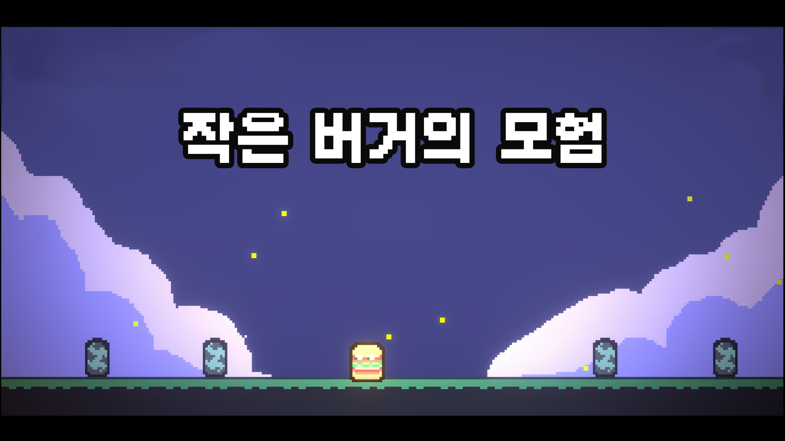
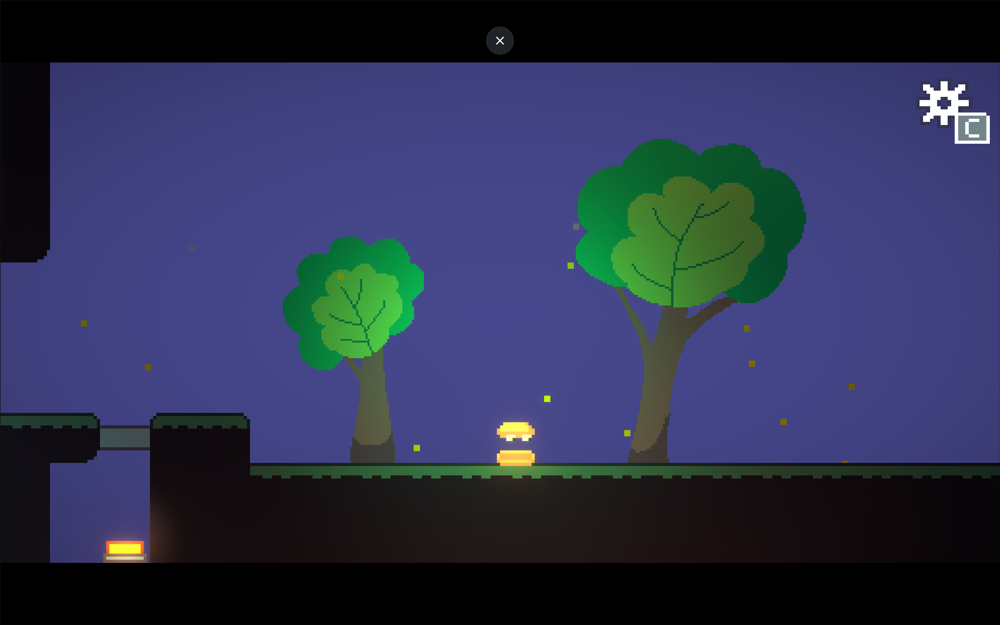
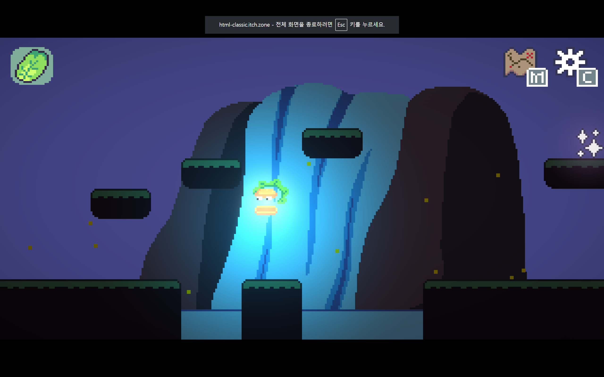
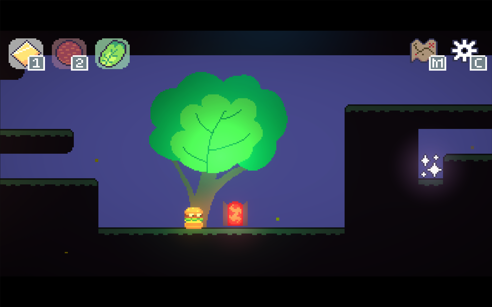
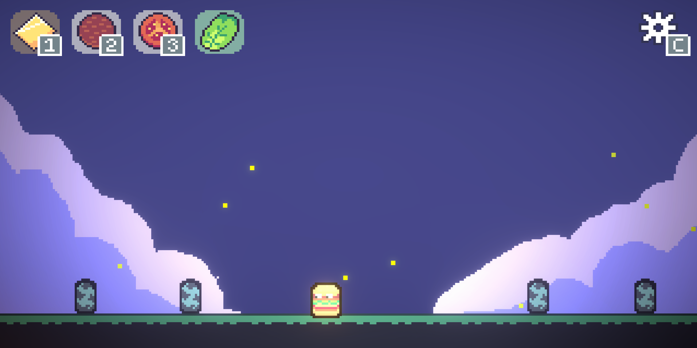

# The Adventure of the Little Burger

**Genre:** Puzzle, Platformer, Metroidvania, Adventure
**Development Period:** 2025.05.05 ~ 05.10
**Role:** Solo Developer
An adventure to become a complete burger.

---

## Download & Play

  <a href="https://adaid.itch.io/the-adventure-of-the-little-burger"
     style="
      display:inline-block;
      padding:14px 24px;
      background:linear-gradient(135deg,#38bdf8,#0ea5e9);
      color:white;
      font-weight:700;
      font-size:16px;
      border-radius:14px;
      text-decoration:none;
      box-shadow:0 10px 25px rgba(14,165,233,0.35);
      transition:0.2s;
     ">
     ⬇ Download or Play on itch.io
  </a>
  <a href="https://www.game-ping.kr/games/the-adventure-of-the-little-burger"
     style="
      display:inline-block;
      padding:14px 24px;
      background:linear-gradient(135deg,#38bdf8,#0ea5e9);
      color:white;
      font-weight:700;
      font-size:16px;
      border-radius:14px;
      text-decoration:none;
      box-shadow:0 10px 25px rgba(14,165,233,0.35);
      transition:0.2s;
     ">
     ⬇ Play on GamePing
  </a>

## About the Game

Collect all the ingredients.
+) As a bonus, try collecting the stars too.

## Screenshots

## Comment

This game was developed in six days for a game jam with the theme "burger".
It was inspired by *Animal Well*.
Burgers are cute.
