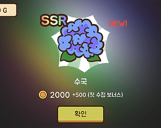
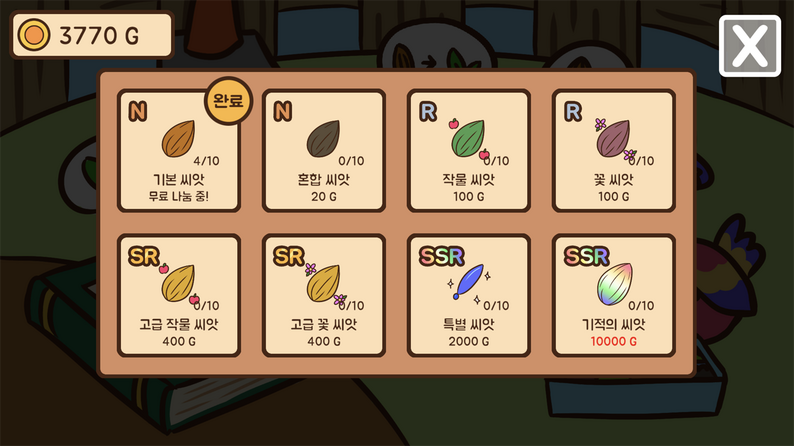
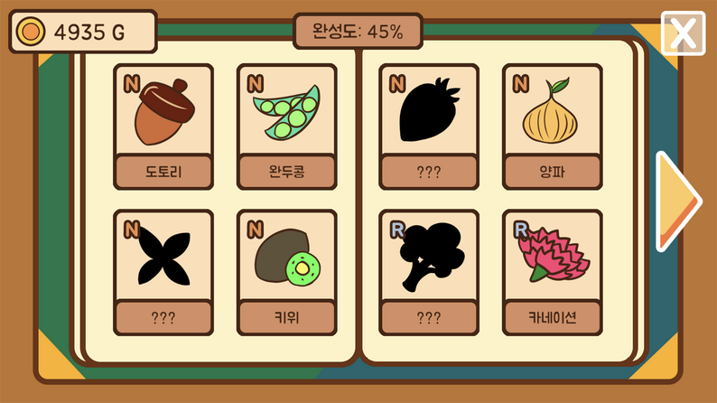
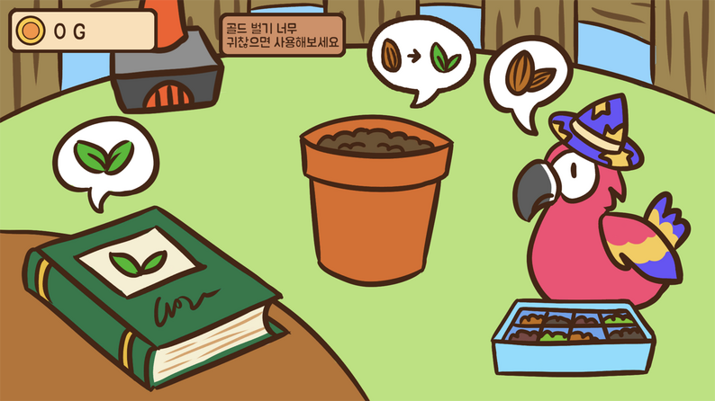

# 힐링 가챠

**장르:** 캐주얼, 가챠
**제작 기간:** 2022.05.20 ~ 05.22
가챠를 통해 돈을 모으고 가챠를 반복할 수 있는 캐주얼 시뮬레이션 게임

---

## 플레이

  <a href="https://adaid.itch.io/healing-gacha"
     style="
      display:inline-block;
      padding:14px 24px;
      background:linear-gradient(135deg,#38bdf8,#0ea5e9);
      color:white;
      font-weight:700;
      font-size:16px;
      border-radius:14px;
      text-decoration:none;
      box-shadow:0 10px 25px rgba(14,165,233,0.35);
      transition:0.2s;
     ">
     ⬇ itch.io에서 웹 플레이
  </a>
  <a href="https://www.game-ping.kr/games/healing-gacha"
     style="
      display:inline-block;
      padding:14px 24px;
      background:linear-gradient(135deg,#38bdf8,#0ea5e9);
      color:white;
      font-weight:700;
      font-size:16px;
      border-radius:14px;
      text-decoration:none;
      box-shadow:0 10px 25px rgba(14,165,233,0.35);
      transition:0.2s;
     ">
     ⬇ 게임핑에서 웹 플레이
  </a>

## 게임 소개

씨앗을 구매하고 가챠를 하여 다양한 식물을 수집하고, 도감 수집률 100%를 노려보세요.
혹시 운이 안 좋아 후반에 골드 얻기가 어려워지셨다면, 일정 시간마다 난로를 이용해보세요.

## 스크린샷

## 코멘트

2022 5월 스토브 게임잼에 제출하기 위해 48시간 동안 개발한 1인 개발 작품입니다.