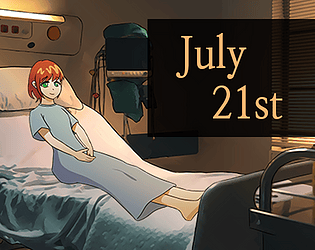
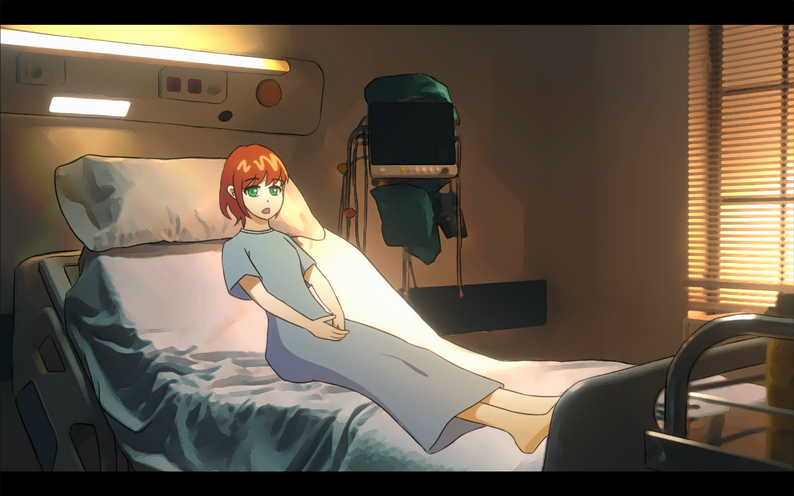
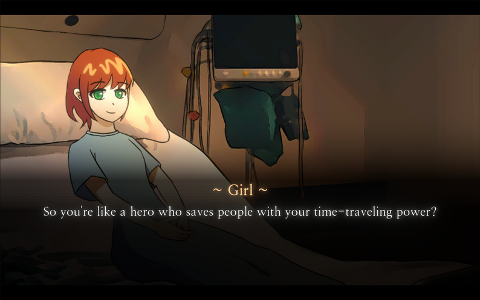

# 7月21日

**ジャンル:** ストーリー
**制作期間:** 2025.07.21（1日）
**担当:** 1人開発
テキスト1000文字未満のビジュアルノベル。

---

## ダウンロード・プレイ

  <a href="https://adaid.itch.io/july-21st"
     style="
      display:inline-block;
      padding:14px 24px;
      background:linear-gradient(135deg,#38bdf8,#0ea5e9);
      color:white;
      font-weight:700;
      font-size:16px;
      border-radius:14px;
      text-decoration:none;
      box-shadow:0 10px 25px rgba(14,165,233,0.35);
      transition:0.2s;
     ">
     ⬇ itch.ioでダウンロード・Webプレイ
  </a>
  <a href="https://www.game-ping.kr/games/july-21st"
     style="
      display:inline-block;
      padding:14px 24px;
      background:linear-gradient(135deg,#38bdf8,#0ea5e9);
      color:white;
      font-weight:700;
      font-size:16px;
      border-radius:14px;
      text-decoration:none;
      box-shadow:0 10px 25px rgba(14,165,233,0.35);
      transition:0.2s;
     ">
     ⬇ GamePingでWebプレイ
  </a>

## ゲーム紹介

あなたは一日をやり直せる探偵です。
7月21日をもう一度始めてください。
- 感情的なストーリー
- 選択肢はたった一つ — 4つのエンディング

## スクリーンショット

## コメント

このゲームは、厳しい制約を持つ2つのゲームジャムに向けて、2025年7月21日の1日でUnityを使って制作されました。その制約は以下の通りです。
- テキスト1000文字未満（韓国語・英語それぞれ）
- キャラクター画像1種（表情変化あり）
- 背景画像1種
- 音楽1種
- 効果音1種
- 選択肢1つ

## クレジット

- 画像: freepik, pexel, pixabay, flaticon
- BGM: https://dova-s.jp/bgm/play2731.html
- 効果音: pixabay
- フォント: 나눔명조（Nanum Myeongjo）
