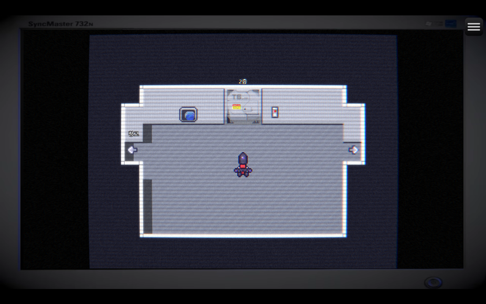
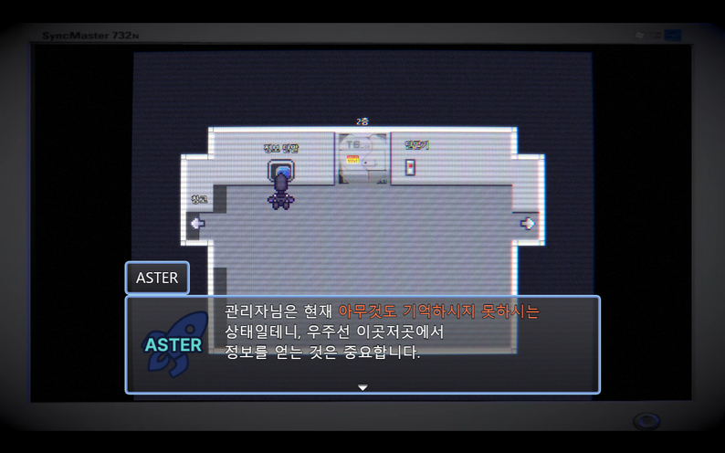
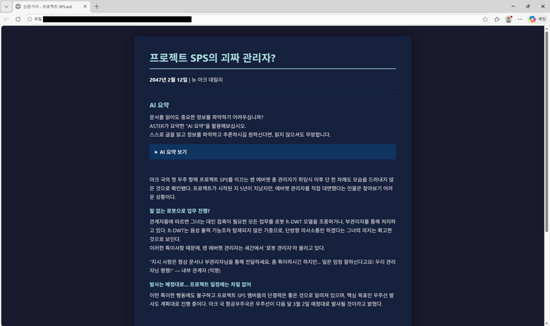
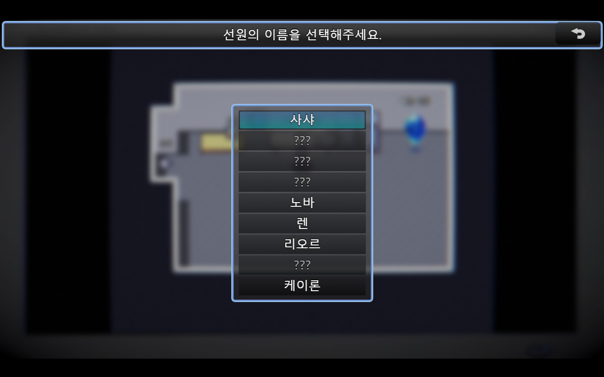

# ロボット管理者

**「1チキン RPGツクールゲームジャム 2026」ストーリー部門受賞!**
**ジャンル:** 推理, ストーリー, アドベンチャー
**制作期間:** 2026.02.14 ~ 03.01
**担当:** 1人開発
ロボットを操作して宇宙船の秘密を解明する、非線形推理ミステリーパズルゲーム。

---

## ダウンロード・プレイ

  <a href="https://adaid.itch.io/robot-manager-1chicken"
     style="
      display:inline-block;
      padding:14px 24px;
      background:linear-gradient(135deg,#38bdf8,#0ea5e9);
      color:white;
      font-weight:700;
      font-size:16px;
      border-radius:14px;
      text-decoration:none;
      box-shadow:0 10px 25px rgba(14,165,233,0.35);
      transition:0.2s;
     ">
     ⬇ itch.ioでダウンロード
  </a>
  <a href="https://www.game-ping.kr/games/robot-manager"
     style="
      display:inline-block;
      padding:14px 24px;
      background:linear-gradient(135deg,#38bdf8,#0ea5e9);
      color:white;
      font-weight:700;
      font-size:16px;
      border-radius:14px;
      text-decoration:none;
      box-shadow:0 10px 25px rgba(14,165,233,0.35);
      transition:0.2s;
     ">
     ⬇ GamePingでダウンロード・Webプレイ
  </a>

## ゲーム紹介

* ダウンロード版またはフルスクリーンでのプレイを推奨します！

「ロボット管理者」として、ロボットを操作し宇宙船で起きた事件の真実を突き止め、乗組員を脱出させましょう。
*Return of the Obra Dinn* や *Outer Wilds* などに影響を受けた、実験的な非線形推理・ミステリーパズル。

## スクリーンショット

## コメント

以下のゲームに影響を受けて制作しました。
* Return of the Obra Dinn
* Outer Wilds
* The Roottrees are Dead
* Lorelei and the Laser Eyes
