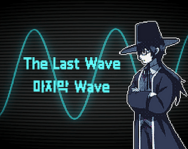
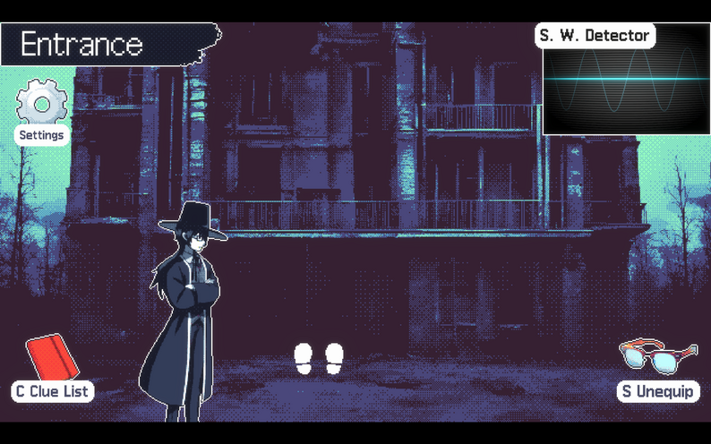
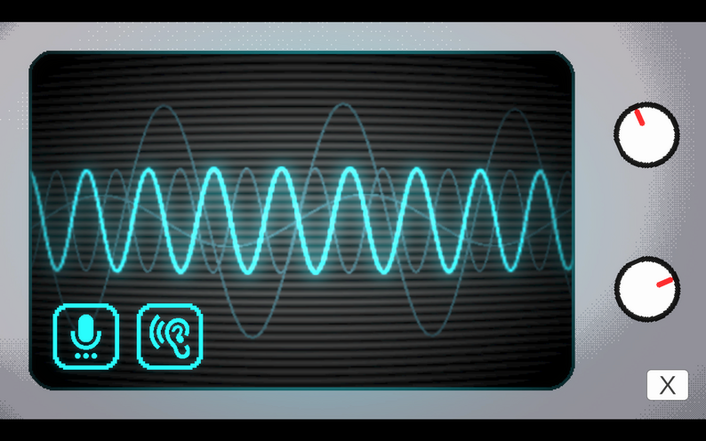
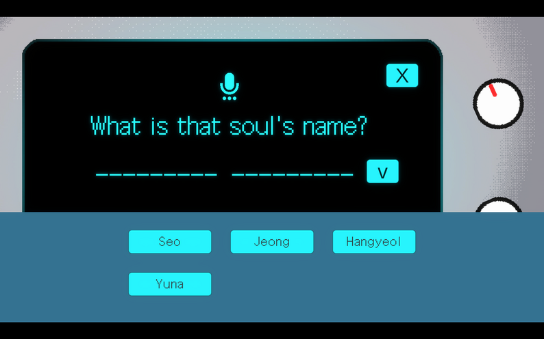

# The Last Wave

**GitHubゲームジャム Overall部門 10位入賞!**
**ジャンル:** 推理, ストーリー
**制作期間:** 2025.11.01 ~ 12.01
**担当:** ディレクション、企画、シナリオ、プログラミング、グラフィック
저승사자（冥府の使者）と共に死者たちの身元を明かし、彼らのハンを解いてあげる推理ゲーム。

---

## ダウンロード・プレイ

  <a href="https://adaid.itch.io/the-last-wave"
     style="
      display:inline-block;
      padding:14px 24px;
      background:linear-gradient(135deg,#38bdf8,#0ea5e9);
      color:white;
      font-weight:700;
      font-size:16px;
      border-radius:14px;
      text-decoration:none;
      box-shadow:0 10px 25px rgba(14,165,233,0.35);
      transition:0.2s;
     ">
     ⬇ itch.ioでダウンロード・Webプレイ
  </a>
  <a href="https://adaid.itch.io/the-last-wave"
     style="
      display:inline-block;
      padding:14px 24px;
      background:linear-gradient(135deg,#38bdf8,#0ea5e9);
      color:white;
      font-weight:700;
      font-size:16px;
      border-radius:14px;
      text-decoration:none;
      box-shadow:0 10px 25px rgba(14,165,233,0.35);
      transition:0.2s;
     ">
     ⬇ GamePingでWebプレイ
  </a>

## ゲーム紹介

真夜中、炎がビルを飲み込み、十の魂が灰の中に埋もれました。
犯人はすでに逮捕されています。事件は解決しました。
…でも、あなたの仕事はここからが本番です。
「ふん、新人のくせになかなかやるじゃないか。…は？これもできないの？こ、このっ…！」
ぶっきらぼうで少しおっちょこちょいな冥府の使者パートナーと共に、死者たちの正体を明かし、彼らの「ハン」を解いてあげなければなりません。
彼らは誰だったのでしょう？何が彼らを引き止めているのでしょう？
焼け残った遺品と、かすかな記憶だけが残るビルの中で、忘れ去られた彼らの物語を探してください。

ゲームの魅力：
1. ぶっきらぼうで憎めない冥府の使者パートナー
2. 各魂の正体を解明するために、波紋・名前・場所を同時に一致させる推理メカニズム
3. 「저승사자（冥府の使者）」「ハン（한）」などの韓国的要素
4. 笑いと感動が交差するストーリー
5. 丁寧に作り込まれたエンディング演出
（ぜひ最後までプレイしてください！）

## スクリーンショット

## コメント

推理ゲーム「Return of the Obra Dinn（オブラ・ディン号の帰還）」に影響を受け、GitHubが主催する Game Off 2025 ゲームジャムに向けて3週間かけて開発したゲームです。
ゲームジャムのテーマは「WAVES」でした。
楽しんでいただけたなら、ぜひ「Return of the Obra Dinn」もプレイしてみてください！

## クレジット

* adaid: ディレクション、企画、シナリオ、プログラミング、グラフィック
* gasbank: プログラミング
* フルクレジット: https://adaid.notion.site/The-Last-Wave-Full-Credit-2bb84d0908ea802b85ffc5627c622c0e
