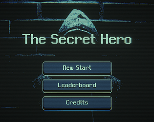
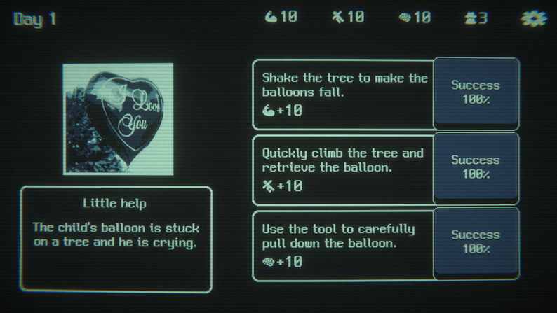
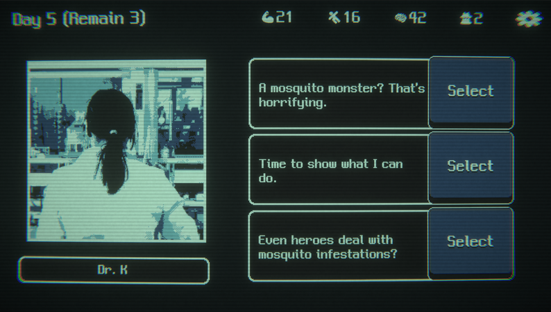

# The Secret Hero

**장르:** 시뮬레이션, 스토리
**제작 기간:** 2024.11.21 ~ 12.02
**담당 파트:** 총괄 및 기획, 시나리오, 메인 프로그래밍, 아트 및 UI 디자인
턴마다 선택을 통해 스탯을 올리며 게임오버를 피해야 하는 게임, 그리고...

---

## 다운로드 및 플레이

  <a href="https://adaid.itch.io/the-secret-hero"
     style="
      display:inline-block;
      padding:14px 24px;
      background:linear-gradient(135deg,#38bdf8,#0ea5e9);
      color:white;
      font-weight:700;
      font-size:16px;
      border-radius:14px;
      text-decoration:none;
      box-shadow:0 10px 25px rgba(14,165,233,0.35);
      transition:0.2s;
     ">
     ⬇ itch.io에서 다운로드 또는 웹 플레이
  </a>
  <a href="https://www.game-ping.kr/games/the-secret-hero"
     style="
      display:inline-block;
      padding:14px 24px;
      background:linear-gradient(135deg,#38bdf8,#0ea5e9);
      color:white;
      font-weight:700;
      font-size:16px;
      border-radius:14px;
      text-decoration:none;
      box-shadow:0 10px 25px rgba(14,165,233,0.35);
      transition:0.2s;
     ">
     ⬇ 게임핑에서 웹 플레이
  </a>

## 게임 소개

이 게임(또는 게임 밖)에는 3가지 비밀이 숨겨져 있습니다. 
비밀 1. 이것은 스피드런과 다회차 플레이 시 유용합니다. 
비밀 2. 비밀을 지켜줄 수 있는 숨겨진 버튼이 있습니다. 
비밀 3. 당신은 누구일까요? '게임 안', 그리고 '게임 밖'에서 '당신'의 정체에 대한 비밀을 찾아보세요. 

## 스크린샷

## 코멘트

이 게임은 GitHub가 주최한 Game Off 2024 게임잼에 제출하기 위해 2주 동안 개발된 게임입니다.

게임잼의 주제는 'Secret'이었고, 이 주제를 잘 녹여내기 위해 게임 플레이에도 '비밀' 스탯이 존재하지만, 게임 속, 게임 밖에도 비밀을 숨겨두었습니다. 

특히, '게임 안'과 '게임 밖'에 있는 정보를 조합해 비밀을 찾아보세요. 

쉽지는 않겠지만, 주인공에 얽힌 스토리와 비밀을 알 수 있게 될 것입니다.

## 크레딧
* 어데이드: 총괄 및 기획, 시나리오, 메인 프로그래밍, 아트 및 UI 디자인
* gasbank: 랭킹 서버 프로그래밍
* hummingengineer: CI
* HongsSeokjun: 리더보드 UI 로직
* 전체 크레딧: https://adaid.notion.site/The-Secret-Hero-Credit-14a84d0908ea8062ad2ee51ae73888ba