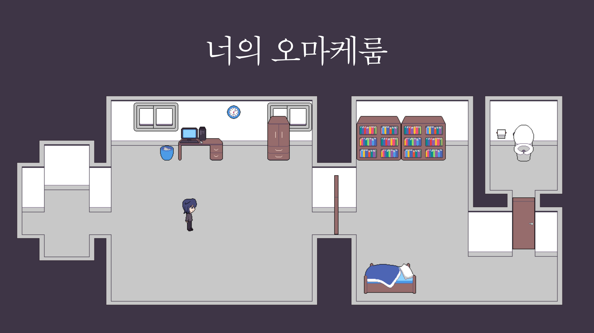
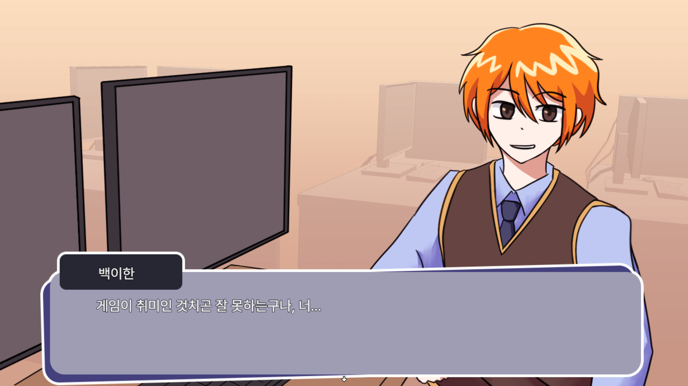
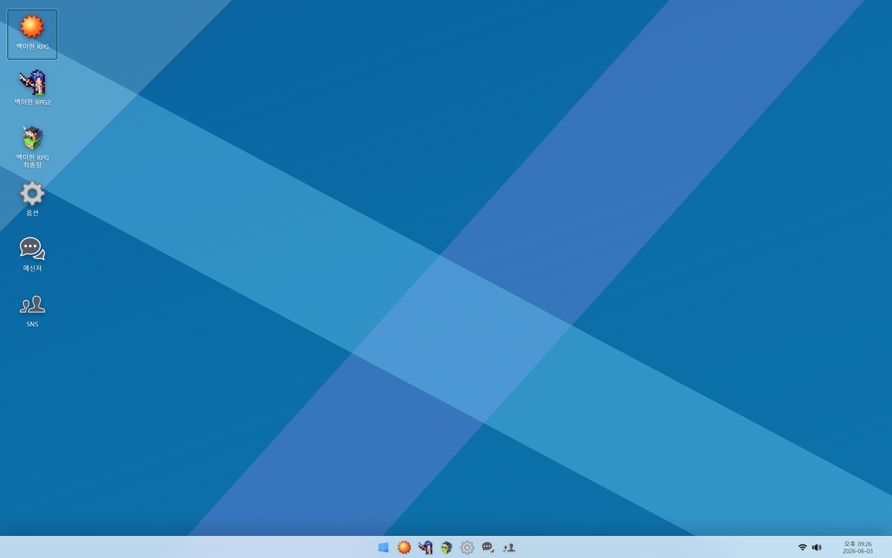
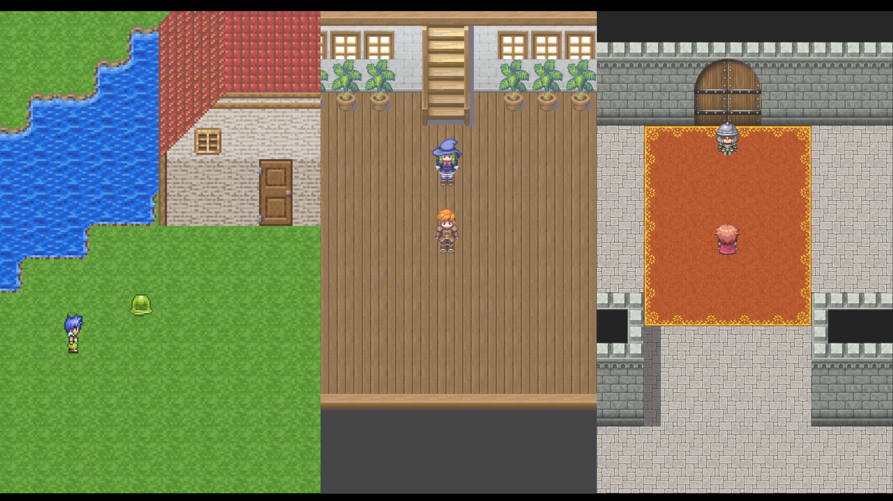

# 너의 오마케룸

**장르:** 실험적, 코미디, 드라마, 공포
**제작 기간:** 2026.05.15 ~ 2026.06.03
**담당 파트:** 제작 전반
서로 다른 쯔꾸르 게임을 오가며 진행하는 쯔꾸르 게임. 유머, 감동, 그리고 공포.

---

## 다운로드 및 플레이

  <a href="https://www.game-ping.kr/games/your-omake-room"
     style="
      display:inline-block;
      padding:14px 24px;
      background:linear-gradient(135deg,#38bdf8,#0ea5e9);
      color:white;
      font-weight:700;
      font-size:16px;
      border-radius:14px;
      text-decoration:none;
      box-shadow:0 10px 25px rgba(14,165,233,0.35);
      transition:0.2s;
     ">
     ⬇ 게임핑에서 다운로드 또는 웹 플레이
  </a>

## 게임 소개
주인공 이하나가 친구인 백이한이 만든 쯔꾸르 게임들을 플레이하며 진행하는 스토리 중심 게임.
가벼운 퍼즐 요소 및 공포 요소가 있습니다.

## 스크린샷

## 코멘트
주제가 '오마케룸'인 베개갯 게임잼에 제출하기 위해 개발한 게임입니다.
오마케룸이라는 주제를 살리기 위해 연출과 스토리에 많은 공을 들였습니다.

## 크레딧

* 제작 전반: 어데이드
* 타이틀 및 엔딩 BGM: Linda
