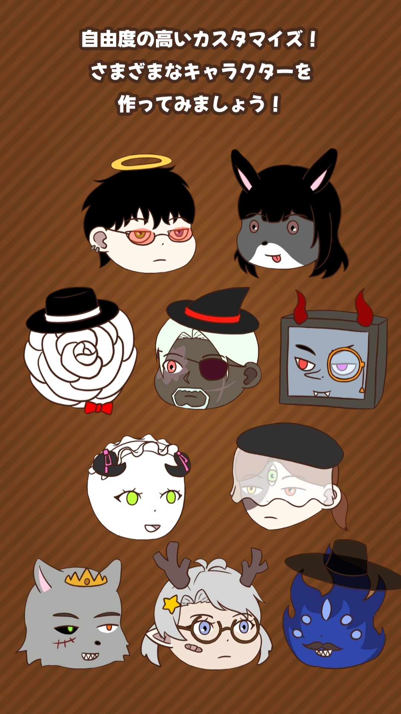

# 샘플 게임

**장르:** 퍼즐 / **플랫폼:** WebGL  
**제작 기간:** 2024.01 ~ 2024.03

---

## 게임 소개

게임 설명을 여기에 자유롭게 적습니다.  
마크다운 문법을 그대로 쓸 수 있습니다.

## 다운로드

  <a href="../games/Chocolate2048/Chocolate2048_Windows.zip" download
     style="
      display:inline-block;
      padding:14px 24px;
      background:linear-gradient(135deg,#38bdf8,#0ea5e9);
      color:white;
      font-weight:700;
      font-size:16px;
      border-radius:14px;
      text-decoration:none;
      box-shadow:0 10px 25px rgba(14,165,233,0.35);
      transition:0.2s;
     ">
     ⬇ Windows 버전 다운로드
  </a>

## 플레이

짧은 소개글입니다.

[play:games/Chocolate2048/Chocolate2048_WebGL/index.html]

조작법:

- WASD 이동
- Space 점프

## 개발 노트

- 어떤 기술을 썼는지
- 만들면서 어려웠던 점
- 배운 것들

## 스크린샷

## 링크

- [itch.io 페이지](https://adaid.itch.io/)